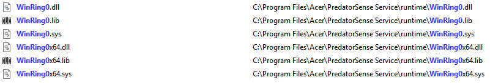

# FanControl.Acer-PO3-640
A plugin for [Fan Control](https://github.com/Rem0o/FanControl.Releases) to add support for the Acer Predator Orion 3000 PO3-640 CPU and case fans. The GPU fans can already be controlled independently by Fan Control.

This plugin works by reading from and writing directly to the correct registers in the Embedded Controller (EC) on the motherboard. This approach is inspired by [NoteBook FanControl](https://github.com/hirschmann/nbfc).

Contains the source code from [Soberia/EmbeddedController](https://github.com/Soberia/EmbeddedController), used under the BSD 3-Clause License. The license and modified source code are present in the [ECLibrary](ECLibrary/) directory.

> [!WARNING]
> This plugin uses the extremely powerful and potentially exploitable WinRing0x64 driver, which may be flagged by Windows Defender. 
>
> Fan Control also uses this driver via [LibreHardwareMonitorLib](https://github.com/LibreHardwareMonitor/LibreHardwareMonitor). Use both Fan Control and my own plugin at your own risk. Also see the Fan Control issue [here](https://github.com/Rem0o/FanControl.Releases/issues/3016). 
> 
> Acer's own PredatorSense also has this driver in its program files, but I don't know if it actually uses it. 
> 
> 


## Installation

The initial release of the plugin is hardcoded to my machine, and will expect yours to be exactly like mine.

### Motherboard
Unless you motherboard is exactly the Predator PO3-640, you **risk overwriting important information** in the Embedded Controller and causing system instability if you run this plugin. 

Check your motherboard model with the following command:
```
wmic baseboard get product
```
I don't know whether there is any further specialisation in name between models. You can confirm whether your motherboard is compatible with my build by completing the first section [of the adaptation guide](/OTHERSYSTEMS.md#finding-the-ec-registers), especially if it's a slightly different model of the Acer Predator Orion 3000. 

If you have a different motherboard / Acer Predator tower (or even a completely different machine), you may wish to [adapt the plugin for it](/OTHERSYSTEMS.md).

### Fans
Unless you have the same fan setup as I do (or one similar RPMs at any rate), this plugin will likely run them inefficiently or at limited speeds. 

My fans are:
- CPU Fan: Noctua NF-A9 (rated 400-2000 rpm, tested 500-2000)
- Front Case Fan: Stock (tested 600-3400 rpm)
- Back Case Fan: Stock (tested 800-3400 rpm)

(The lowest steady speed I found on each stock fan was different.)

If you have a different fan setup, you may wish to [adapt the plugin for it](/CUSTOM.md).

### Still want to install?
- Ensure you have the .NET 8.0 (or greater) version of Fan Control installed. 
Open the About tab in Fan Control. If it says NET 4.8 you'll need to download the .NET 8.0 version from [the official repo](https://github.com/Rem0o/FanControl.Releases/releases/latest). 
- Download the FanControl.Acer-PO3-640.zip file from [the latest release](/releases/latest).
- In Fan Control, go to Settings -> Plugins -> Install Plugin and select the downloaded .zip file.

## Building from source
The project contains three programs:
- FanControl.Acer-PO3-640, a C# .NET 8.0 project that builds the main plugin DLL, containing the Fan Control plugin interace implementations and the fan speed calculation logic. Contained within the AcerPlugin directory. 
- ECLibrary, a C++17 project that builds the ECLibrary.dll file, containing the third-party module to interface with the EC's memory across various files, the vulnerable WinRing0x64 driver, and my own DLL exports to make interop work in dllmain.cpp.  
- TestApp, a C# .NET 8.0 program that tests the ECLibrary.dll file and can write to any EC register. Place the ECLibrary.dll and WinRing0x64.sys files in the folder `Plugins\Acer-PO3-640\` relative to the built program. 

I'm a noob to C# and C++. Don't judge the code quality too hard! Since I was able to build these programs in Visual Studio without too much effort, I'm sure you'll be able to figure it out. If you make any cool additions/modifications, submit a PR!

## Adapting for your own machine
I believe that this plugin could be adapted to support any Acer Predator desktop, or any other machine which controls the fans through the motherboard's Embedded Controller (EC), including the many laptops supported by [NoteBook FanControl](https://github.com/hirschmann/nbfc). 

My version may support other Acer Predator Orion 3000 desktops out-of-the-box, but you must confirm this first by following the steps in the file linked below.

### Learn how to adapt this plugin for your own machine [here](/OTHERSYSTEMS.md).