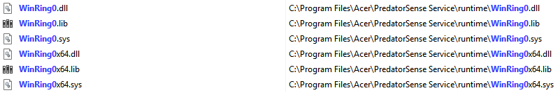

# FanControl.Acer-PO3-640
A plugin for [Fan Control](https://github.com/Rem0o/FanControl.Releases) to add support for the Acer Predator Orion 3000 PO3-640 CPU and case fans. The GPU fans can already be controlled independently by Fan Control.

This plugin works by reading from and writing directly to the correct registers in the Embedded Controller (EC) on the motherboard. This approach is inspired by [NoteBook FanControl](https://github.com/hirschmann/nbfc).

Contains the source code from [Soberia/EmbeddedController](https://github.com/Soberia/EmbeddedController), used under the BSD 3-Clause License. The license and modified source code are present in the [ECLibrary](ECLibrary/) directory.

> [!WARNING]
> This plugin uses the extremely powerful and potentially exploitable WinRing0x64 driver, which may be flagged by Windows Defender. 
>
> Fan Control used to use this driver via [LibreHardwareMonitorLib](https://github.com/LibreHardwareMonitor/LibreHardwareMonitor), which has now switched to another driver called PawnIO. If I have a chance, I'll try to switch this plugin over - otherwise, use it at your own risk
> 
> Acer's own PredatorSense also has this driver in its program files, but I don't know if it actually uses it. 
> 
> 


## Configuration - read this first

The default configuration will work on systems which match mine exactly. Otherwise, you will need to modify the config file (located at `<your FanControl installation>\Plugins\Acer-PO3-640\config.toml` after installation). 

In principle, you could configure this plugin for many other systems which use the EC for fan control (including many laptops), as described in the configuration guide [here](/OTHERSYSTEMS.md). However, I likely won't be able to support you for devices other than the Predator Orion 3000 desktops.

### Motherboard
Check your motherboard model with the following command:
```
wmic baseboard get product
```

If your motherboard is the Predator PO3-640, then the register addresses in the default configuration will be correct. 

Otherwise, you'll need to complete the [first section of the configuration guide](/OTHERSYSTEMS.md#1-finding-the-ec-registers) to find the correct registers. If you don't do this, you risk **overwriting random information** in the Embedded Controller. Do not set a curve on any Control provided by this plugin until you are sure the registers in the config file are correct!

### Fans
Unless you have the same fans as I do (or ones with similar RPM ranges), this plugin will likely run them inefficiently or at limited speeds. 

My fans are:
- CPU Fan: Noctua NF-A9, the one that comes with the popular Noctua NH-U9S cooler (rated 400-2000 rpm, tested 500-2000)
- Front Case Fan: Stock Acer FrostBlade (tested 600-3400 rpm)
- Back Case Fan: Stock Acer FrostBlade (tested 800-3400 rpm, didn't go as low as the front fan)

If you have a different fan setup, use the speeds provided by the manufacturer or complete the [second section of the configuration guide](/OTHERSYSTEMS.md#2-finding-the-minimum-and-maximum-speed) to find the speeds your fans work at in practice.

## Installation

- Ensure you have a .NET 8.0 (or greater) version of Fan Control installed. 
Open the About tab in Fan Control. If it says NET 4.8 you'll need to download the .NET 10.0 version from [the official repo](https://github.com/Rem0o/FanControl.Releases/releases/latest). 
- Download the FanControl.Acer-PO3-640.zip file from [the latest release](/releases/latest).
- In Fan Control, go to Settings -> Plugins -> Install Plugin and select the downloaded .zip file.
- Exit Fan Control, edit the `<your FanControl installation>\Plugins\Acer-PO3-640\config.toml` file as necessary, then relaunch it. Now you should be able to pair the relevant new Controls and Speed Sensors, and set your CPU/case fans to follow a curve.

> [!IMPORTANT]
> **You need to open PredatorSense** before this plugin will work. I've obviously missed some initialisation step it does.
> 
> Configure PredatorSense to **run at startup** (as it does by default) and everything should work correctly. Re-enable the Predator Service if you've disabled it.
>
> You can leave its "Fan Control" tab on the Auto or Custom setting, it shouldn't matter. The Gaming setting overrides this plugin to set the fans to their maximum speed.

## Troubleshooting

### Is PredatorSense configured to launch at startup? 
If not, the plugin may not work. See the section above.

### Is Smart Fan (or another automatic fan control setting) enabled in the BIOS?
I have this disabled. While this should only change what happens before PredatorSense launches, try disabling it if you are running into issues. It is located under Advanced -> PC Health Status.

### Something else?
Open an issue and I'll try to help you solve your problem. Or enlist your local C# expert to look at my noob quality code. Or install Visual Studio, fork this repository and mess around till your problem is fixed, then submit your fix as a PR!

## Building from source
The project contains three programs:
- FanControl.Acer-PO3-640, a C# .NET 8.0 project that builds the main plugin DLL, containing the Fan Control plugin interace implementations and the fan speed calculation logic. Contained within the AcerPlugin directory. 
- ECLibrary, a C++17 project that builds the ECLibrary.dll file, containing the third-party module to interface with the EC's memory across various files, the vulnerable WinRing0x64 driver, and my own DLL exports to make interop work in dllmain.cpp.  
- TestApp, a C# .NET 8.0 program that tests the ECLibrary.dll file and can write to any EC register. Place the ECLibrary.dll and WinRing0x64.sys files in the folder `Plugins\Acer-PO3-640\` relative to the built program. 

I'm a noob to C# and C++. Don't judge the code quality too hard! Since I was able to build these programs in Visual Studio without too much effort, I'm sure you'll be able to figure it out. If you make any cool additions/modifications, submit a PR!


